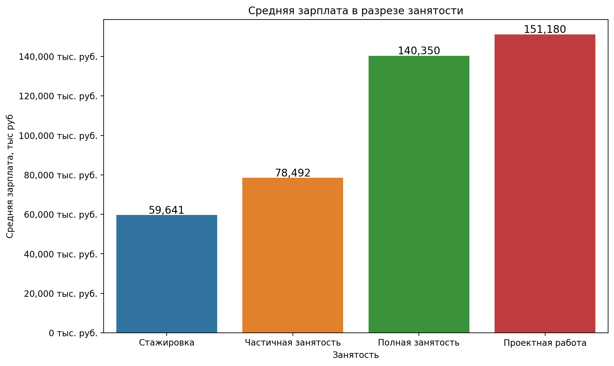

# Научно-исследовательская работа 

## Импорт библиотек


```python
import numpy as np
import pandas as pd

from matplotlib import pyplot as plt
import seaborn as sns

import json
from sklearn.feature_extraction.text import CountVectorizer

from scipy import stats

import plotly.express as px
```

## Чтение данных


```python
# Сначала читаем JSON файл
with open('vacancies_data_with_salary.json', 'r', encoding='utf-8') as file:
    data = json.load(file)

# Затем нормализуем данные
vacancies = pd.json_normalize(data)
df = vacancies.copy()
```


# EDA


```python
df
```


<div>
<style scoped>
    .dataframe tbody tr th:only-of-type {
        vertical-align: middle;
    }

    .dataframe tbody tr th {
        vertical-align: top;
    }

    .dataframe thead th {
        text-align: right;
    }
</style>
<table border="1" class="dataframe">
  <thead>
    <tr style="text-align: right;">
      <th></th>
      <th>id</th>
      <th>name</th>
      <th>area</th>
      <th>published_at</th>
      <th>schedule</th>
      <th>professional_roles</th>
      <th>experience</th>
      <th>employment</th>
      <th>key_skills</th>
      <th>salary.from</th>
      <th>salary.to</th>
      <th>salary.currency</th>
      <th>salary.gross</th>
    </tr>
  </thead>
  <tbody>
    <tr>
      <th>0</th>
      <td>112620411</td>
      <td>Главный бухгалтер</td>
      <td>Москва</td>
      <td>2024-12-05T16:19:49+0300</td>
      <td>Полный день</td>
      <td>[Бухгалтер]</td>
      <td>От 3 до 6 лет</td>
      <td>Полная занятость</td>
      <td>[Бухгалтерская отчетность, Финансовая отчетность]</td>
      <td>350000.0</td>
      <td>500000.0</td>
      <td>RUR</td>
      <td>False</td>
    </tr>
    <tr>
      <th>1</th>
      <td>112595285</td>
      <td>React-разработчик</td>
      <td>Минск</td>
      <td>2024-12-05T13:04:08+0300</td>
      <td>Удаленная работа</td>
      <td>[Программист, разработчик]</td>
      <td>От 1 года до 3 лет</td>
      <td>Полная занятость</td>
      <td>[React, React Native, CSS, HTML, HTML5, Node.j...</td>
      <td>600.0</td>
      <td>950.0</td>
      <td>USD</td>
      <td>False</td>
    </tr>
    <tr>
      <th>2</th>
      <td>112214994</td>
      <td>Frontend-разработчик</td>
      <td>Алматы</td>
      <td>2024-11-30T09:52:47+0300</td>
      <td>Полный день</td>
      <td>[Программист, разработчик]</td>
      <td>От 1 года до 3 лет</td>
      <td>Полная занятость</td>
      <td>[JavaScript, HTML, CSS, VueJS, TypeScript, RES...</td>
      <td>150000.0</td>
      <td>200000.0</td>
      <td>KZT</td>
      <td>True</td>
    </tr>
    <tr>
      <th>3</th>
      <td>112543205</td>
      <td>Backend разработчик (Java)</td>
      <td>Алматы</td>
      <td>2024-12-04T17:40:31+0300</td>
      <td>Полный день</td>
      <td>[Программист, разработчик]</td>
      <td>От 1 года до 3 лет</td>
      <td>Полная занятость</td>
      <td>[Java, Spring Framework, SQL, NoSQL, Git, CI/C...</td>
      <td>1000000.0</td>
      <td>NaN</td>
      <td>KZT</td>
      <td>True</td>
    </tr>
    <tr>
      <th>4</th>
      <td>112524085</td>
      <td>Стажер/frontend разработчик</td>
      <td>Минск</td>
      <td>2024-12-04T14:47:08+0300</td>
      <td>Полный день</td>
      <td>[Программист, разработчик]</td>
      <td>Нет опыта</td>
      <td>Полная занятость</td>
      <td>[]</td>
      <td>NaN</td>
      <td>200.0</td>
      <td>USD</td>
      <td>False</td>
    </tr>
    <tr>
      <th>...</th>
      <td>...</td>
      <td>...</td>
      <td>...</td>
      <td>...</td>
      <td>...</td>
      <td>...</td>
      <td>...</td>
      <td>...</td>
      <td>...</td>
      <td>...</td>
      <td>...</td>
      <td>...</td>
      <td>...</td>
    </tr>
    <tr>
      <th>7923</th>
      <td>110849150</td>
      <td>Engineering &amp; Manufacturing Intern / Стажер пр...</td>
      <td>Тула</td>
      <td>2024-12-03T10:56:39+0300</td>
      <td>Полный день</td>
      <td>[Другое]</td>
      <td>Нет опыта</td>
      <td>Полная занятость</td>
      <td>[]</td>
      <td>100000.0</td>
      <td>NaN</td>
      <td>RUR</td>
      <td>True</td>
    </tr>
    <tr>
      <th>7924</th>
      <td>109079028</td>
      <td>Engineering &amp; Manufacturing Intern / Стажер пр...</td>
      <td>Москва</td>
      <td>2024-11-27T16:20:29+0300</td>
      <td>Полный день</td>
      <td>[Другое]</td>
      <td>Нет опыта</td>
      <td>Стажировка</td>
      <td>[Английский язык]</td>
      <td>100000.0</td>
      <td>NaN</td>
      <td>RUR</td>
      <td>True</td>
    </tr>
    <tr>
      <th>7925</th>
      <td>112419562</td>
      <td>Младший выездной инженер</td>
      <td>Москва</td>
      <td>2024-12-03T13:07:49+0300</td>
      <td>Полный день</td>
      <td>[Мастер по ремонту оборудования, техники]</td>
      <td>Нет опыта</td>
      <td>Полная занятость</td>
      <td>[]</td>
      <td>45000.0</td>
      <td>NaN</td>
      <td>RUR</td>
      <td>True</td>
    </tr>
    <tr>
      <th>7926</th>
      <td>111423693</td>
      <td>Senior ML Engineer</td>
      <td>Москва</td>
      <td>2024-12-05T14:04:15+0300</td>
      <td>Удаленная работа</td>
      <td>[Дата-сайентист]</td>
      <td>От 3 до 6 лет</td>
      <td>Полная занятость</td>
      <td>[Python, SQL, Numpy, pandas, PyTorch, PySpark,...</td>
      <td>NaN</td>
      <td>330000.0</td>
      <td>RUR</td>
      <td>False</td>
    </tr>
    <tr>
      <th>7927</th>
      <td>108659245</td>
      <td>Engineering &amp; Manufacturing Intern / Стажер пр...</td>
      <td>Москва</td>
      <td>2024-12-05T15:58:21+0300</td>
      <td>Полный день</td>
      <td>[Другое]</td>
      <td>Нет опыта</td>
      <td>Стажировка</td>
      <td>[]</td>
      <td>100000.0</td>
      <td>NaN</td>
      <td>RUR</td>
      <td>True</td>
    </tr>
  </tbody>
</table>
<p>7928 rows × 13 columns</p>
</div>


## Обработка пропусков


```python
df.isnull().sum()
```


    id                       0
    name                     0
    area                     0
    published_at             0
    schedule                 0
    professional_roles       0
    experience               0
    employment               0
    key_skills               0
    salary.from            890
    salary.to             3425
    salary.currency          0
    salary.gross             1
    dtype: int64


```python
df = df.drop([ 'salary.gross'], axis=1)
```

## Переменовал колонки


```python
df = df.rename(columns={'salary.from':'salary_from',
                        'salary.to':'salary_to',
                        'salary.currency':'salary_currency',
                        'salary.gross': 'salary_gross'})
```

## Обработал ЗП


```python

```


```python
df[['salary_from', 'salary_to']] = df[['salary_from', 'salary_to']].fillna(0)

# Создание нового столбца 'salary'
def calculate_salary(row):
    if row['salary_from'] != 0 and row['salary_to'] != 0:
        return (row['salary_from'] + row['salary_to']) / 2
    else:
        return row['salary_from'] + row['salary_to']

df['salary'] = df.apply(calculate_salary, axis=1)


```

## Обработка даты публикации


```python
df['published_date'] = pd.to_datetime(df['published_at']).dt.strftime('%Y/%m/%d')
```

## Обработка профессии


```python
df['job'] = df['professional_roles'].apply(lambda x: ', '.join(x))
```


```python
it_positions = ['Разработчик', 'Аналитик', 'Инженер', 'Data', 'Developer', 'Системный администратор', 'Тестировщик', 'UI/UX дизайнер', 'DevOps', 'Machine Learning Engineer', 'Программист', 'Дата', 'Другое']
df = df[df['job'].str.contains('|'.join(it_positions), regex=True)]
```


```python
df = df.drop(['published_at', 'professional_roles', 'salary_from', 'salary_to'], axis=1)
```

## Перевод зп в рубли


```python
# Пример курсов валют
currency_rates = {
    'USD': 94.5,    # Доллар США
    'KZT': 0.2,     # Казахстанский тенге
    'BYR': 0.037,   # Белорусский рубль
    'UZS': 0.0078,  # Узбекский сум
    'EUR': 103.2,   # Евро
    'KGS': 1.08,    # Киргизский сом
    'AZN': 55.0     # Азербайджанский манат
}

# Приведение зарплат к рублям
df['salary_rub'] = df.apply(
    lambda row: row['salary'] * currency_rates.get(row['salary_currency'], 1) if row['salary_currency'] in currency_rates else row['salary'], 
    axis=1
)


```

## Обработка навыков


```python
df["key_skills"] = df["key_skills"].apply(lambda x: ",".join(x) if x else 'Всему научим')


```


```python
df = df.drop('salary', axis=1)
```


```python
df = df.drop(['salary_currency', 'id'], axis=1)
```

## Преобразование типов


```python
df['salary_rub'] = df['salary_rub'].astype(int)

df['published_date'] = pd.to_datetime(df['published_date'])
```

## Итоговая проверка 


```python
df.info()
```

    <class 'pandas.core.frame.DataFrame'>
    Index: 4944 entries, 1 to 7927
    Data columns (total 9 columns):
     #   Column          Non-Null Count  Dtype         
    ---  ------          --------------  -----         
     0   name            4944 non-null   object        
     1   area            4944 non-null   object        
     2   schedule        4944 non-null   object        
     3   experience      4944 non-null   object        
     4   employment      4944 non-null   object        
     5   key_skills      4944 non-null   object        
     6   published_date  4944 non-null   datetime64[ns]
     7   job             4944 non-null   object        
     8   salary_rub      4944 non-null   int64         
    dtypes: datetime64[ns](1), int64(1), object(7)
    memory usage: 386.2+ KB


```python
df.isnull().sum()
```


    name              0
    area              0
    schedule          0
    experience        0
    employment        0
    key_skills        0
    published_date    0
    job               0
    salary_rub        0
    dtype: int64


# Создал датасет для анализа analysis_df


```python
analysis_df = df.copy()

```

## Полезная функция


```python
def plot_percent(df, column_name, title, xlabel, flip_axes=False):
    # Получаем топ-10 значений по заданной колонке
    top_10 = df[column_name].value_counts(normalize=True).multiply(100).round(2).head(10).reset_index(name='percent')
    
    # Строим график
    plt.figure(figsize=(12, 6), dpi=200)
    
    if flip_axes:
        plt.figure(figsize=(16, 8), dpi=200)
        # Если флаг flip_axes True, меняем местами оси X и Y
        sns.barplot(data=top_10, x='percent', y=column_name)
        plt.xlabel('Процент, %')
        plt.ylabel(xlabel)
    else:
        plt.figure(figsize=(12, 6), dpi=200)
        # Иначе, оставляем оси как в оригинале
        sns.barplot(data=top_10, x=column_name, y='percent')
        plt.xlabel(xlabel)
        plt.ylabel('Процент, %')
        plt.xticks(rotation=45)
    
    plt.title(title)

    # Добавляем проценты на столбцы
    for index, value in enumerate(top_10['percent']):
        if flip_axes:
            plt.text(value + 0.5, index, f'{value}%', va='center', ha='left', fontsize=10)
        else:
            plt.text(index, value + 0.5, f'{value}%', ha='center', va='bottom', fontsize=10)

    plt.show()
```

## Расмотрим area

### Уникальные города


```python
print(f'Количество уникальных городов - {analysis_df["area"].nunique()}')
```

    Количество уникальных городов - 251


### Часты города по вакансиям


```python
plot_percent(analysis_df, 'area', 'Топ-10 городов с наибольшим процентом вакансий', 'Город')
```


    <Figure size 2400x1200 with 0 Axes>


    

    


## Расмотрим schedule


```python
plot_percent(analysis_df, 'schedule', 'Распределение графика работы', xlabel='Тип графика')
```


    <Figure size 2400x1200 with 0 Axes>


    

    


## Рассмотрим experience


```python
plot_percent(analysis_df, 'experience', title='Распределение опыта работы', xlabel='Опыт работы')
```


    <Figure size 2400x1200 with 0 Axes>


    

    


## Рассмотрим employment


```python
plot_percent(analysis_df, 'employment', 'Распределение статсуса занятости', 'Cтатус занятости')
```


    <Figure size 2400x1200 with 0 Axes>


    

    


## Рассмотрим job


```python
plot_percent(analysis_df, 'job', 'ТОП-10 Профессий', 'Профессия', True)
```


    <Figure size 2400x1200 with 0 Axes>


    

    


## Расмотрим salary


```python

from matplotlib.ticker import FuncFormatter

# Построение графика
plt.figure(figsize=(10, 6))
sns.boxplot(x=analysis_df['salary_rub'])

# Форматирование оси X
formatter = FuncFormatter(lambda x, pos: f'{int(x / 1000):,} тыс. руб.')
plt.gca().xaxis.set_major_formatter(formatter)

plt.xlabel('Зарплата')
plt.title('Распределение зарплат')
plt.tight_layout()
plt.show()
```


    

    


```python
plt.figure(figsize=(15,8), dpi=200)


# Вычисляем моду
mode_salary = analysis_df['salary_rub'].mode()[0]

# Построение histplot с KDE для распределения зарплат

sns.histplot(analysis_df['salary_rub'], kde=True, color='skyblue', bins=30)

# Изменяем ось X, чтобы отображать значения в тысячах
plt.xlabel('Зарплата (тыс. руб.)')
plt.ylabel('Частота')
plt.title('Распределение зарплат с KDE')

# Добавляем линию моды на график
plt.axvline(mode_salary, color='red', linestyle='--', label=f'Мода: {mode_salary/1000:.2f} тыс. руб.')

# Показываем легенду
plt.legend()

# Настроим ось X, шаг 50 тыс.
xticks = np.arange(0, analysis_df['salary_rub'].max() + 50000, step=50000)  # Шаг 50 тыс.
plt.xticks(xticks, labels=[f'{int(x/1000)}' for x in xticks])  # Без "тыс. руб." в метках

plt.tight_layout()
plt.show()
```


    

    


# Гипотезы

## Гипотеза: Заработная плата зависит от региона.

### Зарплата в городе Минск неверно отображается - исправим 


```python
# Преобразуем зарплату внутри DataFrame для региона 'Минск', если зарплата меньше 1000
analysis_df.loc[(analysis_df['area'] == 'Минск') & (analysis_df['salary_rub'] < 1000), 'salary_rub'] *= 1000
```


```python
top_10_area = analysis_df[analysis_df['area'].isin(['Москва', 'Санкт-Петербург', 'Екатеринбург', 'Казань', 'Алматы', 'Ростов-на-Дону', 'Новосибирск', 'Минск', 'Краснодар', 'Астана'])]

# Используем .loc для изменения значения в столбце
top_10_area.loc[:, 'salary_rub'] = top_10_area['salary_rub'] / 1000  # Преобразуем зарплату в тысячи

plt.figure(figsize=(12, 6))
sns.boxplot(data=top_10_area, y='area', x='salary_rub')
plt.ylabel('Регион')
plt.xlabel('Зарплата (тыс. руб.)')
plt.title('Заработная плата по регионам')
plt.show()
```


    

    


## Гипотеза: Чем больше опыта, тем выше заработная плата.


```python

```


```python
experience_salary = analysis_df.groupby('experience')['salary_rub'].mean().round().reset_index(name='mean_salary').sort_values(by='mean_salary')
experience_salary
```


<div>
<style scoped>
    .dataframe tbody tr th:only-of-type {
        vertical-align: middle;
    }

    .dataframe tbody tr th {
        vertical-align: top;
    }

    .dataframe thead th {
        text-align: right;
    }
</style>
<table border="1" class="dataframe">
  <thead>
    <tr style="text-align: right;">
      <th></th>
      <th>experience</th>
      <th>mean_salary</th>
    </tr>
  </thead>
  <tbody>
    <tr>
      <th>1</th>
      <td>Нет опыта</td>
      <td>71308.0</td>
    </tr>
    <tr>
      <th>2</th>
      <td>От 1 года до 3 лет</td>
      <td>113581.0</td>
    </tr>
    <tr>
      <th>3</th>
      <td>От 3 до 6 лет</td>
      <td>207756.0</td>
    </tr>
    <tr>
      <th>0</th>
      <td>Более 6 лет</td>
      <td>285242.0</td>
    </tr>
  </tbody>
</table>
</div>


```python
# Построение графика
plt.figure(figsize=(10, 6), dpi=200)
ax = sns.barplot(data=experience_salary, x='experience', y='mean_salary')

# Добавление значений над столбцами
for p in ax.patches:
    ax.annotate(f'{p.get_height():,.0f}', 
                (p.get_x() + p.get_width() / 2., p.get_height()), 
                ha='center', va='center', 
                fontsize=12, color='black', 
                xytext=(0, 5), textcoords='offset points')

# Форматирование оси Y
formatter = FuncFormatter(lambda x, pos: f'{int(x):,} тыс. руб.')
ax.yaxis.set_major_formatter(formatter)

# Подписи и заголовок
plt.xlabel('Опыт')
plt.ylabel('Средняя зарплата, тыс руб')
plt.title('Средняя зарплата в разрезе опыта')

# Показ графика
plt.tight_layout()
plt.show()
```


    

    


## Гипотеза: Полная занятость дает более высокую зарплату по сравнению со стажировками.


```python
analysis_df
```


<div>
<style scoped>
    .dataframe tbody tr th:only-of-type {
        vertical-align: middle;
    }

    .dataframe tbody tr th {
        vertical-align: top;
    }

    .dataframe thead th {
        text-align: right;
    }
</style>
<table border="1" class="dataframe">
  <thead>
    <tr style="text-align: right;">
      <th></th>
      <th>name</th>
      <th>area</th>
      <th>schedule</th>
      <th>experience</th>
      <th>employment</th>
      <th>key_skills</th>
      <th>published_date</th>
      <th>job</th>
      <th>salary_rub</th>
    </tr>
  </thead>
  <tbody>
    <tr>
      <th>1</th>
      <td>React-разработчик</td>
      <td>Минск</td>
      <td>Удаленная работа</td>
      <td>От 1 года до 3 лет</td>
      <td>Полная занятость</td>
      <td>React,React Native,CSS,HTML,HTML5,Node.js,JSON</td>
      <td>2024-12-05</td>
      <td>Программист, разработчик</td>
      <td>73237</td>
    </tr>
    <tr>
      <th>2</th>
      <td>Frontend-разработчик</td>
      <td>Алматы</td>
      <td>Полный день</td>
      <td>От 1 года до 3 лет</td>
      <td>Полная занятость</td>
      <td>JavaScript,HTML,CSS,VueJS,TypeScript,REST API,ES6</td>
      <td>2024-11-30</td>
      <td>Программист, разработчик</td>
      <td>35000</td>
    </tr>
    <tr>
      <th>3</th>
      <td>Backend разработчик (Java)</td>
      <td>Алматы</td>
      <td>Полный день</td>
      <td>От 1 года до 3 лет</td>
      <td>Полная занятость</td>
      <td>Java,Spring Framework,SQL,NoSQL,Git,CI/CD,Dock...</td>
      <td>2024-12-04</td>
      <td>Программист, разработчик</td>
      <td>200000</td>
    </tr>
    <tr>
      <th>4</th>
      <td>Стажер/frontend разработчик</td>
      <td>Минск</td>
      <td>Полный день</td>
      <td>Нет опыта</td>
      <td>Полная занятость</td>
      <td>Всему научим</td>
      <td>2024-12-04</td>
      <td>Программист, разработчик</td>
      <td>18900</td>
    </tr>
    <tr>
      <th>5</th>
      <td>Junior Frontend-разработчик</td>
      <td>Санкт-Петербург</td>
      <td>Удаленная работа</td>
      <td>Нет опыта</td>
      <td>Полная занятость</td>
      <td>JavaScript,REST API,Git,TypeScript,React Nativ...</td>
      <td>2024-12-04</td>
      <td>Программист, разработчик</td>
      <td>125000</td>
    </tr>
    <tr>
      <th>...</th>
      <td>...</td>
      <td>...</td>
      <td>...</td>
      <td>...</td>
      <td>...</td>
      <td>...</td>
      <td>...</td>
      <td>...</td>
      <td>...</td>
    </tr>
    <tr>
      <th>7922</th>
      <td>Engineering &amp; Manufacturing Intern / Стажер пр...</td>
      <td>Томск</td>
      <td>Полный день</td>
      <td>Нет опыта</td>
      <td>Стажировка</td>
      <td>Всему научим</td>
      <td>2024-12-04</td>
      <td>Другое</td>
      <td>100000</td>
    </tr>
    <tr>
      <th>7923</th>
      <td>Engineering &amp; Manufacturing Intern / Стажер пр...</td>
      <td>Тула</td>
      <td>Полный день</td>
      <td>Нет опыта</td>
      <td>Полная занятость</td>
      <td>Всему научим</td>
      <td>2024-12-03</td>
      <td>Другое</td>
      <td>100000</td>
    </tr>
    <tr>
      <th>7924</th>
      <td>Engineering &amp; Manufacturing Intern / Стажер пр...</td>
      <td>Москва</td>
      <td>Полный день</td>
      <td>Нет опыта</td>
      <td>Стажировка</td>
      <td>Английский язык</td>
      <td>2024-11-27</td>
      <td>Другое</td>
      <td>100000</td>
    </tr>
    <tr>
      <th>7926</th>
      <td>Senior ML Engineer</td>
      <td>Москва</td>
      <td>Удаленная работа</td>
      <td>От 3 до 6 лет</td>
      <td>Полная занятость</td>
      <td>Python,SQL,Numpy,pandas,PyTorch,PySpark,Hadoop...</td>
      <td>2024-12-05</td>
      <td>Дата-сайентист</td>
      <td>330000</td>
    </tr>
    <tr>
      <th>7927</th>
      <td>Engineering &amp; Manufacturing Intern / Стажер пр...</td>
      <td>Москва</td>
      <td>Полный день</td>
      <td>Нет опыта</td>
      <td>Стажировка</td>
      <td>Всему научим</td>
      <td>2024-12-05</td>
      <td>Другое</td>
      <td>100000</td>
    </tr>
  </tbody>
</table>
<p>4944 rows × 9 columns</p>
</div>


```python
employment_salary =analysis_df.groupby('employment')['salary_rub'].mean().round().reset_index(name='mean_salary').sort_values(by='mean_salary')
employment_salary
```


<div>
<style scoped>
    .dataframe tbody tr th:only-of-type {
        vertical-align: middle;
    }

    .dataframe tbody tr th {
        vertical-align: top;
    }

    .dataframe thead th {
        text-align: right;
    }
</style>
<table border="1" class="dataframe">
  <thead>
    <tr style="text-align: right;">
      <th></th>
      <th>employment</th>
      <th>mean_salary</th>
    </tr>
  </thead>
  <tbody>
    <tr>
      <th>2</th>
      <td>Стажировка</td>
      <td>59641.0</td>
    </tr>
    <tr>
      <th>3</th>
      <td>Частичная занятость</td>
      <td>78492.0</td>
    </tr>
    <tr>
      <th>0</th>
      <td>Полная занятость</td>
      <td>140350.0</td>
    </tr>
    <tr>
      <th>1</th>
      <td>Проектная работа</td>
      <td>151180.0</td>
    </tr>
  </tbody>
</table>
</div>


```python
# Построение графика
plt.figure(figsize=(10, 6), dpi=200)
ax = sns.barplot(data=employment_salary, x='employment', y='mean_salary')

# Добавление значений над столбцами
for p in ax.patches:
    ax.annotate(f'{p.get_height():,.0f}', 
                (p.get_x() + p.get_width() / 2., p.get_height()), 
                ha='center', va='center', 
                fontsize=12, color='black', 
                xytext=(0, 5), textcoords='offset points')

# Форматирование оси Y
formatter = FuncFormatter(lambda x, pos: f'{int(x):,} тыс. руб.')
ax.yaxis.set_major_formatter(formatter)

# Подписи и заголовок
plt.xlabel('Занятость')
plt.ylabel('Средняя зарплата, тыс руб')
plt.title('Средняя зарплата в разрезе занятости')

# Показ графика
plt.tight_layout()
plt.show()
```


    

    


## Гипотеза: Вакансии с фразой “Всему научим” имеют низкую зарплату.


```python

# Проверяем, есть ли фраза "Всему научим" в key_skills
analysis_df['has_training'] = analysis_df['key_skills'].str.contains('Всему научим', case=False, na=False)

# Преобразуем значения в 'has_training'
analysis_df['has_training'] = analysis_df['has_training'].apply(lambda x: 'Навыки не требуются' if x else 'Навыки требуются')

```


```python
has_training_salary = analysis_df.groupby('has_training')['salary_rub'].mean()
has_training_salary
```


    has_training
    Навыки не требуются    132159.620213
    Навыки требуются       139918.316025
    Name: salary_rub, dtype: float64


```python


# Разделяем данные на две группы по значению 'has_training'
group_with_training = analysis_df[analysis_df['has_training'] == 'Навыки не требуются']['salary_rub']
group_without_training = analysis_df[analysis_df['has_training'] == 'Навыки требуются']['salary_rub']

# Проверяем нормальность распределения для каждой группы с помощью теста Шапиро-Уилка
shapiro_with_training = stats.shapiro(group_with_training.dropna())
shapiro_without_training = stats.shapiro(group_without_training.dropna())

# Если p-value меньше 0.05, то распределение не нормально
if shapiro_with_training.pvalue < 0.05 or shapiro_without_training.pvalue < 0.05:
    print('Данные не распределены нормально, используем непараметрический тест Манна-Уитни.')
    # Применяем тест Манна-Уитни для независимых выборок
    u_stat, p_value = stats.mannwhitneyu(group_with_training, group_without_training, alternative='two-sided')
else:
    print('Данные распределены нормально, используем t-тест.')
    # Проводим t-тест для независимых выборок
    t_stat, p_value = stats.ttest_ind(group_with_training, group_without_training, nan_policy='omit')

# Проверяем значимость различий
if p_value < 0.05:
    print(f'Различия в зарплатах статистически значимы (p-value = {p_value})')
else:
    # Округляем p-value до 2 знаков после запятой в выводе
    print(f'Различия в зарплатах не статистически значимы (p-value = {p_value})')

analysis_df = analysis_df.drop(['has_training'], axis=1)
```

    Данные не распределены нормально, используем непараметрический тест Манна-Уитни.
    Различия в зарплатах статистически значимы (p-value = 0.04068661721120872)


## ТОП-10 навыков для каждой профессии IT


```python
# Фильтруем "Всему научим" и считаем частоту навыков
skills_by_job = (
    analysis_df
    .assign(key_skills=analysis_df['key_skills'].str.split(','))  # Разделяем навыки в списки
    .explode('key_skills')  # Разделяем строки для каждого навыка
    .query("key_skills != 'Всему научим'")  # Исключаем строки с навыком "Всему научим"
    .groupby(['job', 'key_skills'])  # Группируем по профессии и навыку
    .size()  # Считаем количество упоминаний каждого навыка
    .reset_index(name='count')  # Преобразуем в DataFrame
)

# Находим топ-10 навыков для каждой профессии и объединяем их в одну строку
top_skills_by_job = (
    skills_by_job
    .sort_values(['job', 'count'], ascending=[True, False])  # Сортируем
    .groupby('job')  # Группируем по профессии
    .head(10)  # Берем топ-10 навыков
    .groupby('job')['key_skills']  # Группируем по профессии снова
    .apply(lambda x: ', '.join(x))  # Объединяем топовые навыки через запятую
    .reset_index(name='top_skills')  # Преобразуем в DataFrame
)
```


```python
# Подготовка данных
top_skills_by_job['job'] = top_skills_by_job['job'].str.wrap(30)  # Ограничиваем длину названия профессий
top_skills_by_job['top_skills'] = top_skills_by_job['top_skills'].str.wrap(100)  # Ограничиваем длину строки навыков
top_skills_by_job = top_skills_by_job.sort_values('job', ascending=True)  # Сортируем профессии

# Увеличиваем размер графика
plt.figure(figsize=(18, 14))  # Ещё больше пространства

# Построение горизонтального барчарта
bars = plt.barh(top_skills_by_job['job'], [1] * len(top_skills_by_job), color='skyblue', height=0.8)  # Увеличиваем высоту столбцов

# Добавление аннотаций (навыков)
for bar, skills in zip(bars, top_skills_by_job['top_skills']):
    plt.text(
        0.02,  # Сдвигаем текст немного вправо
        bar.get_y() + bar.get_height() / 2,
        skills,
        ha='left',
        va='center',
        fontsize=10,
        color='black',
    )

# Настройки графика
plt.xlabel('Навыки', fontsize=14, labelpad=15)  # Отдаляем подпись оси X
plt.ylabel('Профессии', fontsize=14, labelpad=15)  # Отдаляем подпись оси Y
plt.title('Топ-10 навыков по профессиям', fontsize=16, pad=20)  # Отдаляем заголовок
plt.xticks([])  # Убираем ось X
plt.tight_layout(pad=2.5)  # Увеличиваем расстояние между элементами

# Показ графика
plt.show()

```


    

    


```python
analysis_df
```


<div>
<style scoped>
    .dataframe tbody tr th:only-of-type {
        vertical-align: middle;
    }

    .dataframe tbody tr th {
        vertical-align: top;
    }

    .dataframe thead th {
        text-align: right;
    }
</style>
<table border="1" class="dataframe">
  <thead>
    <tr style="text-align: right;">
      <th></th>
      <th>name</th>
      <th>area</th>
      <th>schedule</th>
      <th>experience</th>
      <th>employment</th>
      <th>key_skills</th>
      <th>published_date</th>
      <th>job</th>
      <th>salary_rub</th>
    </tr>
  </thead>
  <tbody>
    <tr>
      <th>1</th>
      <td>React-разработчик</td>
      <td>Минск</td>
      <td>Удаленная работа</td>
      <td>От 1 года до 3 лет</td>
      <td>Полная занятость</td>
      <td>React,React Native,CSS,HTML,HTML5,Node.js,JSON</td>
      <td>2024-12-05</td>
      <td>Программист, разработчик</td>
      <td>73237</td>
    </tr>
    <tr>
      <th>2</th>
      <td>Frontend-разработчик</td>
      <td>Алматы</td>
      <td>Полный день</td>
      <td>От 1 года до 3 лет</td>
      <td>Полная занятость</td>
      <td>JavaScript,HTML,CSS,VueJS,TypeScript,REST API,ES6</td>
      <td>2024-11-30</td>
      <td>Программист, разработчик</td>
      <td>35000</td>
    </tr>
    <tr>
      <th>3</th>
      <td>Backend разработчик (Java)</td>
      <td>Алматы</td>
      <td>Полный день</td>
      <td>От 1 года до 3 лет</td>
      <td>Полная занятость</td>
      <td>Java,Spring Framework,SQL,NoSQL,Git,CI/CD,Dock...</td>
      <td>2024-12-04</td>
      <td>Программист, разработчик</td>
      <td>200000</td>
    </tr>
    <tr>
      <th>4</th>
      <td>Стажер/frontend разработчик</td>
      <td>Минск</td>
      <td>Полный день</td>
      <td>Нет опыта</td>
      <td>Полная занятость</td>
      <td>Всему научим</td>
      <td>2024-12-04</td>
      <td>Программист, разработчик</td>
      <td>18900</td>
    </tr>
    <tr>
      <th>5</th>
      <td>Junior Frontend-разработчик</td>
      <td>Санкт-Петербург</td>
      <td>Удаленная работа</td>
      <td>Нет опыта</td>
      <td>Полная занятость</td>
      <td>JavaScript,REST API,Git,TypeScript,React Nativ...</td>
      <td>2024-12-04</td>
      <td>Программист, разработчик</td>
      <td>125000</td>
    </tr>
    <tr>
      <th>...</th>
      <td>...</td>
      <td>...</td>
      <td>...</td>
      <td>...</td>
      <td>...</td>
      <td>...</td>
      <td>...</td>
      <td>...</td>
      <td>...</td>
    </tr>
    <tr>
      <th>7922</th>
      <td>Engineering &amp; Manufacturing Intern / Стажер пр...</td>
      <td>Томск</td>
      <td>Полный день</td>
      <td>Нет опыта</td>
      <td>Стажировка</td>
      <td>Всему научим</td>
      <td>2024-12-04</td>
      <td>Другое</td>
      <td>100000</td>
    </tr>
    <tr>
      <th>7923</th>
      <td>Engineering &amp; Manufacturing Intern / Стажер пр...</td>
      <td>Тула</td>
      <td>Полный день</td>
      <td>Нет опыта</td>
      <td>Полная занятость</td>
      <td>Всему научим</td>
      <td>2024-12-03</td>
      <td>Другое</td>
      <td>100000</td>
    </tr>
    <tr>
      <th>7924</th>
      <td>Engineering &amp; Manufacturing Intern / Стажер пр...</td>
      <td>Москва</td>
      <td>Полный день</td>
      <td>Нет опыта</td>
      <td>Стажировка</td>
      <td>Английский язык</td>
      <td>2024-11-27</td>
      <td>Другое</td>
      <td>100000</td>
    </tr>
    <tr>
      <th>7926</th>
      <td>Senior ML Engineer</td>
      <td>Москва</td>
      <td>Удаленная работа</td>
      <td>От 3 до 6 лет</td>
      <td>Полная занятость</td>
      <td>Python,SQL,Numpy,pandas,PyTorch,PySpark,Hadoop...</td>
      <td>2024-12-05</td>
      <td>Дата-сайентист</td>
      <td>330000</td>
    </tr>
    <tr>
      <th>7927</th>
      <td>Engineering &amp; Manufacturing Intern / Стажер пр...</td>
      <td>Москва</td>
      <td>Полный день</td>
      <td>Нет опыта</td>
      <td>Стажировка</td>
      <td>Всему научим</td>
      <td>2024-12-05</td>
      <td>Другое</td>
      <td>100000</td>
    </tr>
  </tbody>
</table>
<p>4944 rows × 9 columns</p>
</div>


```python

```


```python
# Фильтрация данных, начиная с 6 ноября 2024 года
start_date = pd.to_datetime("2024-11-06")
df_filtered = df[df['published_date'] >= start_date]

# Группировка данных по дате публикации и профессии
df_grouped = df_filtered.groupby([df_filtered['published_date'].dt.date, 'job']).size().reset_index(name='count')

# Построение графика
fig = px.line(df_grouped, x='published_date', y='count', color='job', 
              title='Тренд профессий по времени',
              labels={'published_date': 'Дата публикации', 'count': 'Количество вакансий'})
fig.show()
```


## Вывод: Анализ графика показывает, что в выходные дни (период между 10 и 17 ноября, а также между 17 и 24 ноября) количество опубликованных вакансий по всем представленным профессиям значительно снижается. Это заметно по проседанию всех линий графика в указанные периоды. После выходных наблюдается рост числа вакансий. Это указывает на то, что большинство компаний публикуют вакансии в рабочие дни.


